# Dallas County Courts Portal Scraper - Flow Diagrams

**Version:** 1.0  
**Last Updated:** 2025-11-27

This document provides comprehensive visual flow diagrams of the system architecture, execution flow, and data processing pipeline using Mermaid syntax.

---

## Table of Contents

1. [System Architecture Overview](#1-system-architecture-overview)
2. [Main Execution Flow](#2-main-execution-flow)
3. [Concurrent Processing Flow](#3-concurrent-processing-flow)
4. [Single Attorney Scraping Flow](#4-single-attorney-scraping-flow)
5. [Case Extraction Loop](#5-case-extraction-loop)
6. [Captcha Resolution Flow](#6-captcha-resolution-flow)
7. [Data Flow Diagram](#7-data-flow-diagram)
8. [Error Handling & Recovery Flow](#8-error-handling--recovery-flow)
9. [Session Recovery Flow](#9-session-recovery-flow)
10. [Export Flow](#10-export-flow)

---

## 1. System Architecture Overview

### 1.1 Component Architecture

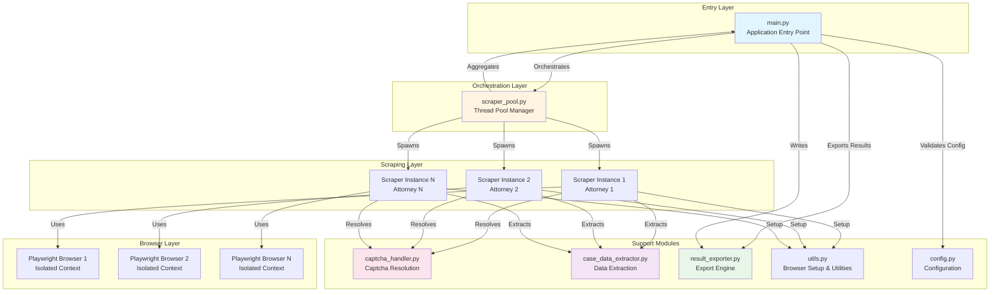

### 1.2 Module Dependencies

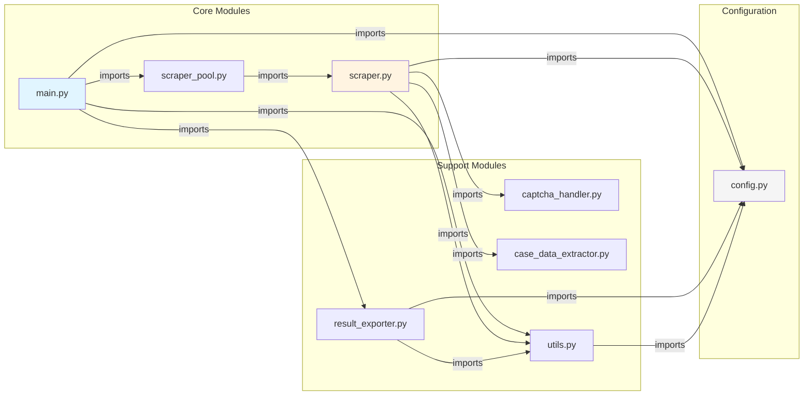

---

## 2. Main Execution Flow

### 2.1 Complete Application Flow

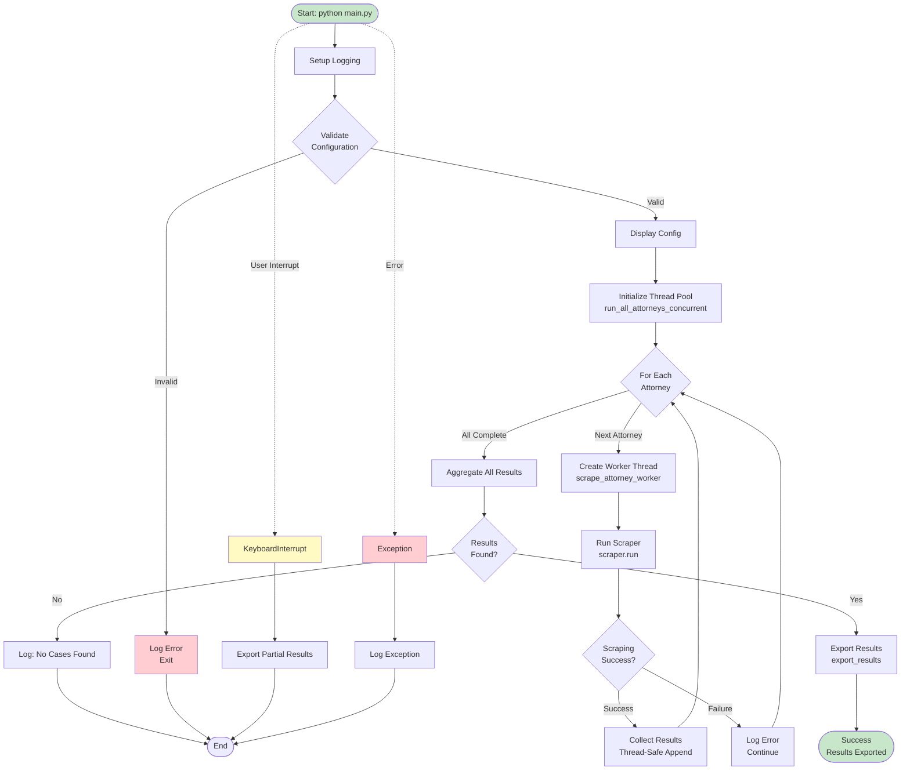

---

## 3. Concurrent Processing Flow

### 3.1 Thread Pool Execution

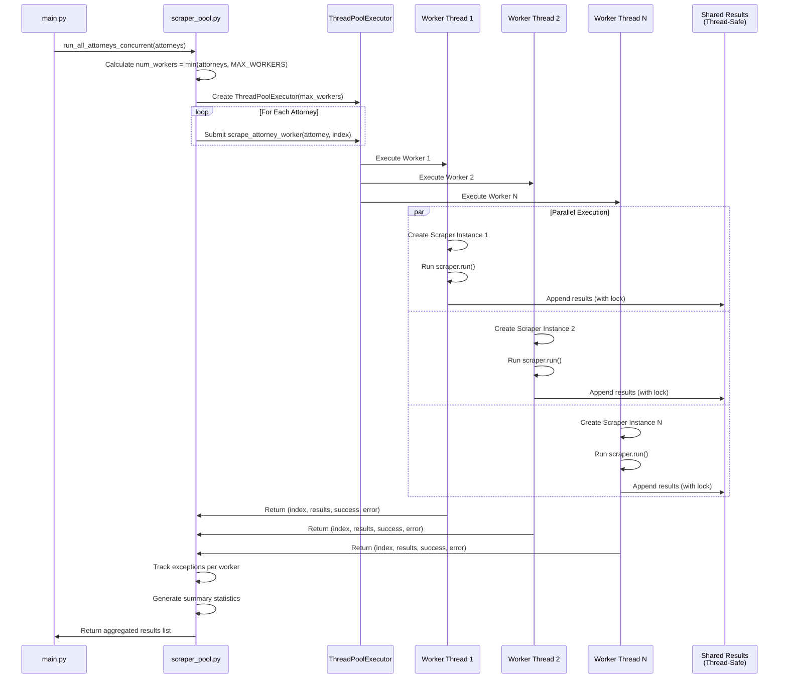

---

## 4. Single Attorney Scraping Flow

### 4.1 Complete Scraper Workflow

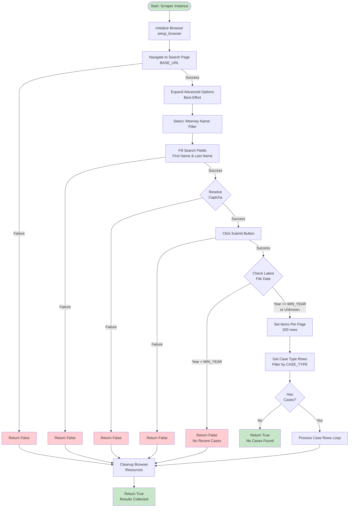

---

## 5. Case Extraction Loop

### 5.1 Detailed Case Processing Flow

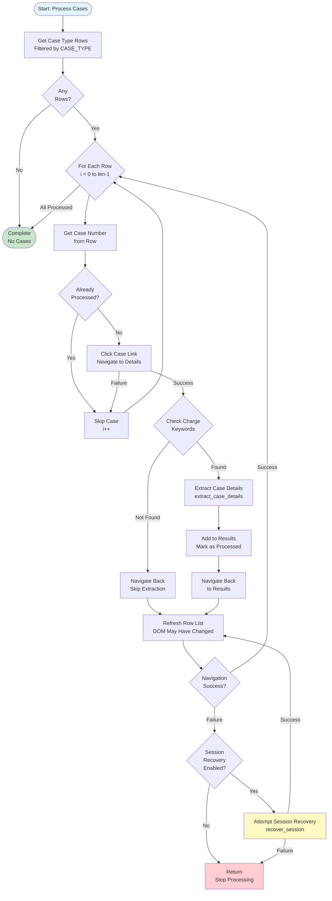

### 5.2 Case Detail Extraction Process

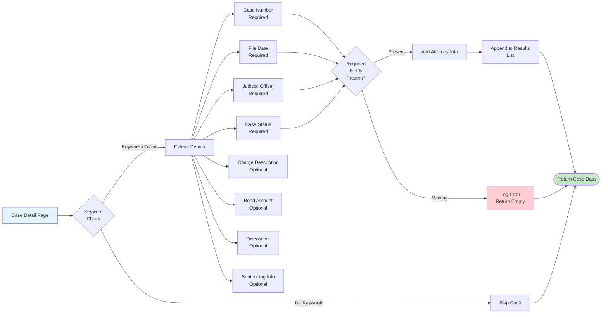

---

## 6. Captcha Resolution Flow

### 6.1 Captcha Handling Decision Tree

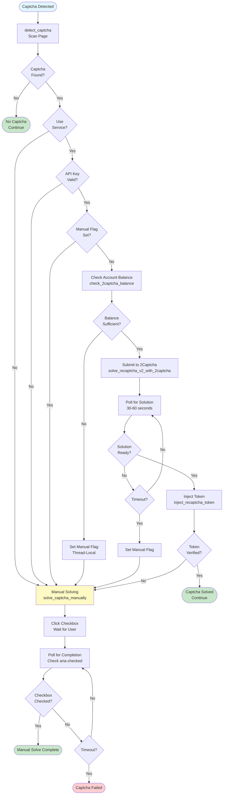

---

## 7. Data Flow Diagram

### 7.1 End-to-End Data Flow

```mermaid
flowchart LR
    subgraph "Input"
        CONFIG[config.py<br/>ATTORNEYS<br/>CHARGE_KEYWORDS<br/>MINIMUM_CASE_YEAR]
    end
    
    subgraph "Processing"
        POOL[Thread Pool<br/>Concurrent Execution]
        SCRAPER1[Scraper 1]
        SCRAPER2[Scraper 2]
        SCRAPERn[Scraper N]
    end
    
    subgraph "Data Extraction"
        FILTER1[Date Filter<br/>Case Type Filter]
        EXTRACT1[Extract Case Details]
        FILTER2[Date Filter<br/>Case Type Filter]
        EXTRACT2[Extract Case Details]
        FILTERn[Date Filter<br/>Case Type Filter]
        EXTRACTn[Extract Case Details]
    end
    
    subgraph "Storage"
        RESULTS1[Results List 1<br/>In-Memory]
        RESULTS2[Results List 2<br/>In-Memory]
        RESULTSn[Results List N<br/>In-Memory]
    end
    
    subgraph "Aggregation"
        AGGREGATE[Aggregated Results<br/>Thread-Safe Collection]
    end
    
    subgraph "Transformation"
        DATAFRAME[pandas DataFrame<br/>Column Mapping]
    end
    
    subgraph "Output"
        EXCEL[Excel File<br/>Multi-Sheet]
        CSV[CSV File]
        JSON[JSON File]
    end
    
    CONFIG --> POOL
    POOL --> SCRAPER1
    POOL --> SCRAPER2
    POOL --> SCRAPERn
    
    SCRAPER1 --> FILTER1
    SCRAPER2 --> FILTER2
    SCRAPERn --> FILTERn
    
    FILTER1 --> EXTRACT1
    FILTER2 --> EXTRACT2
    FILTERn --> EXTRACTn
    
    EXTRACT1 --> RESULTS1
    EXTRACT2 --> RESULTS2
    EXTRACTn --> RESULTSn
    
    RESULTS1 --> AGGREGATE
    RESULTS2 --> AGGREGATE
    RESULTSn --> AGGREGATE
    
    AGGREGATE --> DATAFRAME
    DATAFRAME --> EXCEL
    DATAFRAME --> CSV
    DATAFRAME --> JSON
    
    style CONFIG fill:#e1f5ff
    style AGGREGATE fill:#fff4e1
    style DATAFRAME fill:#f3e5f5
    style EXCEL fill:#c8e6c9
    style CSV fill:#c8e6c9
    style JSON fill:#c8e6c9
```

### 7.2 Case Data Structure Flow

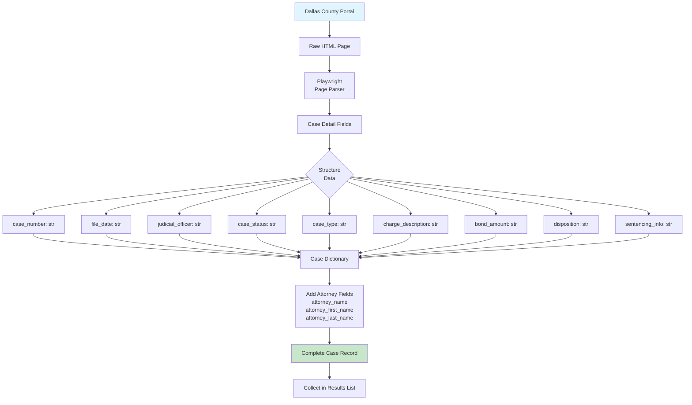

---

## 8. Error Handling & Recovery Flow

### 8.1 Error Handling Strategy

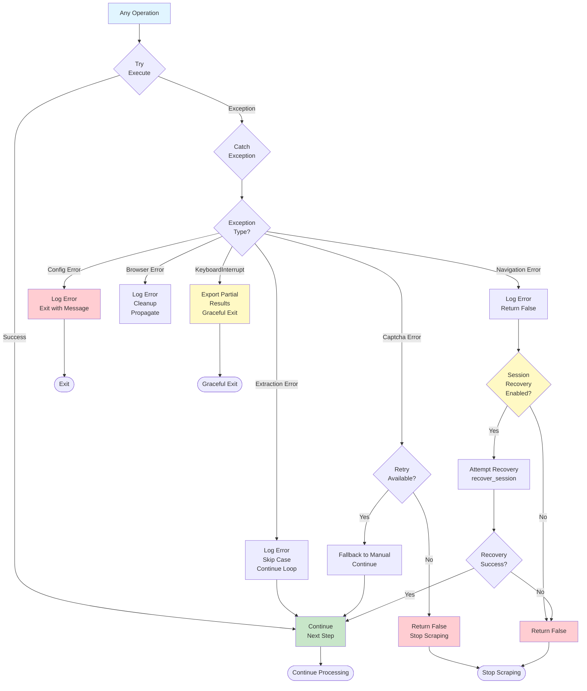

---

## 9. Session Recovery Flow

### 9.1 Recovery Process

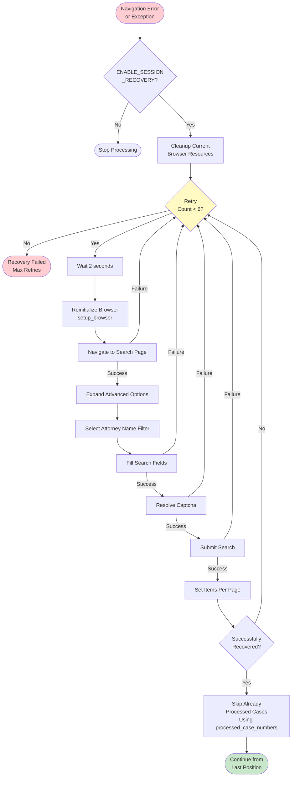

---

## 10. Export Flow

### 10.1 Result Export Process

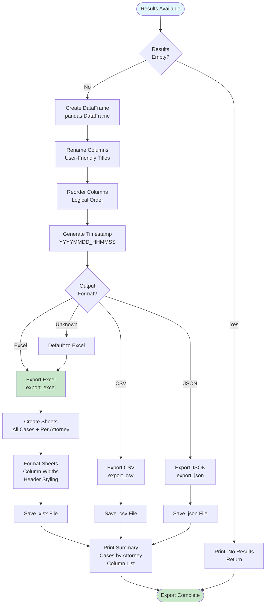

---

## Diagram Legend

### Node Types

- **Rectangle (`[ ]`)**: Process or action
- **Diamond (`{ }`)**: Decision point or condition
- **Rounded Rectangle (`([ ])`)**: Start/End points
- **Parallelogram**: Data input/output
- **Double Rectangle**: Sub-process or external system

### Arrow Types

- **Solid Arrow (`-->`)**: Normal flow
- **Dashed Arrow (`-.->`)**: Exception or interrupt flow
- **Labeled Arrow (`--Label-->`)**: Conditional branch with label

### Color Coding

- 🟢 **Green**: Success states, completion points
- 🔴 **Red**: Error states, failure points
- 🟡 **Yellow**: Warning states, recovery attempts
- 🔵 **Blue**: Entry points, initialization
- 🟣 **Purple**: Data transformation points
- ⚪ **White/Gray**: Standard processes

---

## Key Behavioral Notes

### Execution Characteristics

1. **Concurrent Processing**: Multiple attorneys are processed simultaneously using thread pools, each with isolated browser instances
2. **Error Isolation**: Failures in one attorney's processing do not affect others
3. **Session Recovery**: Navigation failures trigger automatic recovery attempts when enabled
4. **Partial Result Preservation**: Interruptions preserve and export any collected results

### Filtering Strategy

1. **Date Filtering**: Early exit if newest case doesn't meet minimum year requirement (prevents processing stale data)
2. **Case Type Filtering**: Only rows containing configured case type (default: "FELONY") are processed
3. **Charge Keyword Filtering**: Applied at case detail level - cases without matching keywords are skipped entirely

### Resource Management

1. **Browser Isolation**: Each attorney gets independent browser context
2. **Automatic Cleanup**: Browser resources are cleaned up in `finally` blocks
3. **Thread Safety**: Result aggregation uses locks to prevent race conditions

### Data Flow

1. **In-Memory Accumulation**: Results collected during scraping, exported at completion
2. **Thread-Safe Collection**: Concurrent results safely merged using locking mechanisms
3. **Structured Output**: Data transformed to pandas DataFrame with user-friendly column names

---

**Diagram Version**: 1.0  
**Last Updated**: 2025-11-27
**Maintainer**: Jin

For detailed technical specifications, refer to `TECHNICAL_DOCUMENTATION.md`.
